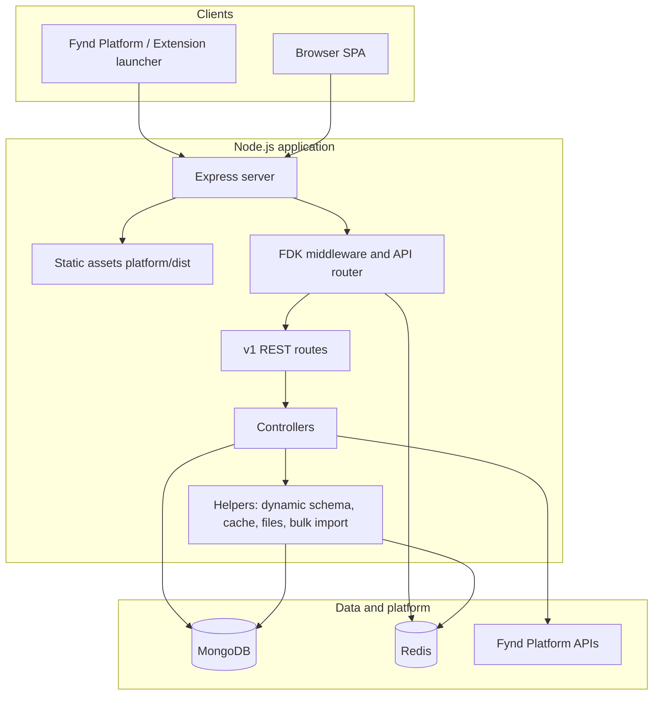
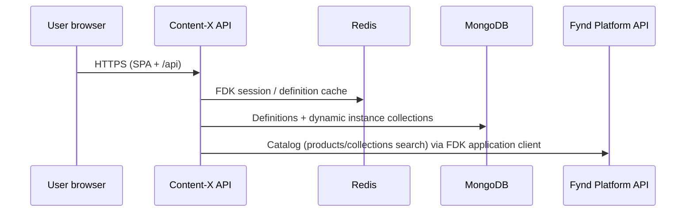

# Content-X — System Design

This document describes the architecture of **Content-X** (npm package name: `groot`): a **Fynd Platform extension** that provides a **schema-driven CMS** for companies and applications. Operators define **object definitions** (field schemas), **publish** them, and manage **object instances** (documents) scoped per company and application.

---

## 1. Goals and scope


| Goal                        | How it is addressed                                                                                                                              |
| --------------------------- | ------------------------------------------------------------------------------------------------------------------------------------------------ |
| Configurable content models | `ObjectDefinition` documents describe fields, types, validation, and relations.                                                                  |
| Safe multi-tenancy          | Every instance read/write merges `company_id` and `application_id` into queries; dynamic collections are shared by slug but filtered per tenant. |
| Platform integration        | **FDK** (`fdk-extension-javascript`) handles extension OAuth, session storage in Redis, and access to Fynd APIs (e.g. catalog search).           |
| Operational visibility      | Sentry, New Relic, health endpoints (`/_healthz`, `/_readyz`).                                                                                   |


**Non-goals** (inferred from the codebase): Content-X is not a public storefront; it is an **admin/extension UI + API** for merchants on Fynd.

---

## 2. High-level architecture




### 2.1 Runtime entry and process model

- **Entry**: `index.js` loads config, initializes Mongo/Redis/Sentry (`app/init.js`), then starts the HTTP server from `app/server.js` when `MODE` is `server`.
- **Single process**: One Node process listens on `PORT` (default **8082** per `app/common/config.js`).

---

## 3. Technology stack


| Layer               | Technology                                                                              |
| ------------------- | --------------------------------------------------------------------------------------- |
| API                 | **Express 4**, `body-parser` limits (large JSON for rich content), `multer` for uploads |
| Data                | **MongoDB** via **Mongoose 6**                                                          |
| Cache / FDK storage | **Redis** (`ioredis`), FDK `RedisStorage` with key prefix `groot`                       |
| Frontend            | **Vue 2**, **Vue Router** (history mode), **Axios**, **@gofynd/nitrozen-vue**           |
| Platform SDK        | `fdk-client-javascript`, `fdk-extension-javascript`                                     |
| Observability       | **Sentry** (`@sentry/node`), **New Relic**                                              |
| Config              | **convict** + environment variables                                                     |


---

## 4. Deployment topology (logical)

- **Container / host**: Runs as a Node service (config references `K8S_POD_NAME`, suggesting Kubernetes-style deployment).
- **Build artifact**: The Vue app is built to `platform/dist`; Express serves it as static files and falls back to `index.html` for SPA routes.
- **External dependencies**: MongoDB, Redis, Fynd Platform API cluster (`https://api.<FYND_PLATFORM_DOMAIN>`), optional Sentry/New Relic endpoints.

---

## 5. HTTP routing

Order in `app/server.js` (simplified):

1. **Cookies & JSON** — `cookie-parser`, `express.json` (large limit), `urlencoded`.
2. `**GET /env.js`** — Injects `window.env` for the browser (merges `BROWSER_CONFIG` and Sentry-related fields).
3. **Swagger** — Documentation route.
4. **Health** — `/_healthz`, `/_readyz`.
5. **Static** — `platform/dist`.
6. **FDK handler** — Extension install/auth and session handling.
7. **API** — `app.use('/api', fdkExtension.apiRoutes)` with nested `v1` router.
8. **SPA fallback** — `GET *` returns `platform/dist/index.html`.

**Effective API base path**: `/api/v1/...` (FDK `apiRoutes` + `v1.router`).

---

## 6. Authentication and authorization

- **FDK** wraps API routes: requests that hit `/api` go through `fdkExtension.fdkHandler` and the FDK `apiRoutes` pipeline so handlers receive `**platformClient`** and related context (see e.g. `search.controller.js`).
- **Scopes** (from `app/fdk/index.js`): `company/saleschannel`, `company/application/settings`, `company/product`.
- **Access mode**: `offline` — suitable for background or token-refresh flows per FDK conventions.
- **Redis**: Stores extension session/state for the FDK layer (`RedisStorage`).

*Instance-level authorization* is enforced by **always scoping data** to `company_id` and `application_id` from the request context helpers, not by ad hoc checks in each controller only.

---

## 7. Core domain model

### 7.1 Object definitions (schema)

- Stored as **Mongoose** models such as `ObjectDefinition` (`app/models/objectDefinition.model.js`).
- Each field has a **`field_type`** taken from a fixed enum (see below); validation, Mongoose paths, filters, and bulk import behavior are implemented in `app/helpers/dynamic-collection.helper.js` (`FIELD_TYPES`) and related helpers.
- Definitions have lifecycle **`status`** (`DRAFT` \| `PUBLISHED`) and optional **`usage_mode`** (`standalone` \| `embedded_only`) — see [Usage modes](#712-usage-modes-standalone-vs-embedded_only).
- **`Slug`** identifies the definition in URLs and drives dynamic MongoDB collection names for **standalone** instance data.

#### 7.1.1 Field types (handled)

The following **`field_type`** values are accepted on `ObjectDefinition.fields[]` (`app/models/objectDefinition.model.js`) and honored when building dynamic schemas, validating payloads, and (where applicable) listing filters (`buildFilterQuery`, `is_filterable`).


| `field_type` | Role / storage | Notes |
| ------------ | -------------- | ----- |
| `text` | Short string | Trimmed string; filterable for list API when `is_filterable`. |
| `long_text` | Multi-line string | Trimmed string. |
| `number` | Numeric | Stored as `Number`; validation and optional filter operators (`gt`, `gte`, `lt`, `lte`) in `buildFilterQuery`. |
| `file` | File metadata (`Mixed`) | Uploads via multipart + `uploadFile.utils` / platform client; `file_config` restricts types and sizes (`cms-file-field.helper.js`). Multiple files when `multiple`. |
| `date` | Date (date only) | Parsed/stored as `Date`. |
| `date_time` | Date and time | Parsed/stored as `Date`. |
| `url` | URL string | Trimmed string; URL validation on write. |
| `json` | Arbitrary JSON (`Mixed`) | Object/array structure. |
| `html` | HTML string | Trimmed string; intended for rich HTML bodies. |
| `multiple_values` | `String[]` | Tags/chips style; optional `options` for allowed values; not the same as `multiple` on other types. |
| `dropdown` | Single selection | `options` list; stored as string or structured value depending on payload; filterable when `is_filterable`. |
| `radio` | Single selection | Same pattern as `dropdown`; `options`. |
| `checkbox` | One or many strings | Without `multiple`: single `String`; with `multiple`: array of strings; `options` when constrained. |
| `product` | Platform product relation (`Mixed`) | Normalized via `normalizeRelationFieldValue`; typically holds uid/slug/id-style references for catalog products. Filter indexes use subpaths `.uid`, `.slug`, `.id` when `is_filterable`. |
| `collection` | Platform collection relation (`Mixed`) | Same normalization pattern as `product` for catalog collections. |
| `custom_object` | Embedded object or array (`Mixed`) | **`ref_definition_slug`** must point to another **published** definition (UI restricts choices to **`embedded_only`** types — `FieldTypeEditor.vue`). Single object or array when `multiple`. Payloads are normalized with `normalizeEmbeddedCustomObjectInput` / `normalizeEmbeddedCustomObjectArrayInput` (nested field values; legacy link-only objects stripped). Nested file fields can use `cms-embedded-file-upload.helper.js`. |

**Cross-cutting field options** (all types): `required`, `regex_pattern`, `placeholder`, `default_value` (where supported in UI), `multiple` (except where not applicable — e.g. `multiple_values`), `is_filterable` (adds tenant-scoped indexes and list filters for supported types), `relation` (`none` \| `product` \| `collection`) on the field schema for relation semantics where used.

**Not a field type:** tenant scope is always `company_id` and `application_id` on each instance document — not user-defined fields.

#### 7.1.2 Usage modes: standalone vs embedded_only

`ObjectDefinition.usage_mode` (`app/models/objectDefinition.model.js`) controls whether instances of that definition are managed as **first-class rows** in the slug’s MongoDB collection, or only as **nested payloads** inside other objects.

| Mode | Meaning | API / product behavior |
| ---- | ------- | ---------------------- |
| **`standalone`** (default) | A normal CMS type with its own instance collection (sanitized slug). | **Instance routes** under `/api/v1/cms/:slug/...` work: list, get by id, create, update, delete, bulk template download, bulk import (`dynamicObject.controller.js`). The SPA can open the object list and editor for this definition (`CmsDefinitions.vue` shows an entry to manage objects when not `embedded_only`). |
| **`embedded_only`** | Schema exists for reuse **only** inside **`custom_object`** fields on *other* definitions. | Instance CRUD and bulk routes **reject** with **403** and message *embedded-only and cannot be managed as standalone objects* (`ensureStandaloneDefinition`). **Allowed:** `GET .../cms/:slug/definition` for the published schema (so parent forms can render nested fields). **Data path:** embedded instances are stored as **nested documents** (or arrays of documents) on the **parent** instance document in the **parent’s** collection — not via standalone create/list for the child slug. |

**Composition rule:** In the definition editor, a `custom_object` field may only select **`ref_definition_slug`** among definitions whose **`usage_mode` is `embedded_only`** (`embeddedObjectDefinitionChoices` in `FieldTypeEditor.vue`). That prevents referencing a standalone type as an embed (standalone types are edited via their own instance APIs).

**Deletion / impact:** When deleting a definition, the UI considers standalone **entry counts** in that type’s collection; embedded-only types are framed as embedded object shapes (see `CmsDefinitions.vue` copy for deletion impact).

### 7.2 Publishing and versions

- `**ObjectDefinitionVersion`** (`app/models/objectDefinitionVersion.model.js`) stores **versioned snapshots** (`snapshot` payload, `version` number, optional `comment`, linkage to `definition_id`).
- Publishing flows are implemented in `objectDefinitionPublish.controller.js` (not expanded here; see code for exact rules).

### 7.3 Object instances (dynamic collections)

- `**dynamic-collection.helper.js`** compiles a **per-definition Mongoose model** whose name matches one **physical MongoDB collection** per slug (sanitized slug only — no prefix; see §7.5).
- **Tenant isolation**: Documents include `company_id` and `application_id`; `mergeTenantScope` ensures these win over user-supplied filters.
- **Validation**: Instance payloads are validated against the published definition (including relation fields and embedded custom objects).
- **Caching**: Published definition JSON for a slug can be read from **Redis** (`schema-cache.helper.js`, TTL ~1 hour, key prefix `cms:definition:`) to reduce Mongo reads.

### 7.4 Files and bulk operations

- **File fields**: Validated via `cms-file-field.helper.js`; embedded uploads use `cms-embedded-file-upload.helper.js` (see `uploadFile.utils` usage in controllers).
- **Bulk import**: `cms-bulk-import.helper.js` supports template download and workbook/CSV import (`bulkImportInstances`, template routes in `v1.router.js`).

### 7.5 Database schema (MongoDB)

All application data uses the **host** Mongo connection (`app/common/mongo.init.js`, URI from `MONGO_PRODUCT_TAGS_READ_WRITE`). Mongoose **registered models** use default collection names (lowercased, pluralized). **CMS instance** data lives in **per-slug physical collections** whose names are derived from the definition slug (see below).

```mermaid
erDiagram
  ObjectDefinition ||--o{ ObjectDefinitionVersion : "definition_id"
  ObjectDefinition {
    objectId _id PK
    string company_id
    string application_id
    string name
    string slug UK "unique with tenant"
    string description
    string usage_mode "standalone | embedded_only"
    string status "DRAFT | PUBLISHED"
    int version
    array fields "embedded FieldSchema"
    date published_at
    string created_by
    string updated_by
    date createdAt
    date updatedAt
  }
  ObjectDefinitionVersion {
    objectId _id PK
    string company_id
    string application_id
    objectId definition_id FK
    int version UK "unique with tenant + definition"
    string status "DRAFT | PUBLISHED"
    mixed snapshot
    string comment
    string created_by
    date createdAt
    date updatedAt
  }
  Config {
    objectId _id PK
    string company_id
    string application_id
    string created_by
    date created_at
    bool is_enabled
    date createdAt
    date updatedAt
  }
  CMSInstance["CMS instance documents (dynamic collection per slug)"] {
    objectId _id PK
    string company_id
    string application_id
    mixed "user-defined fields from published definition"
    date createdAt
    date updatedAt
  }
```

#### Fixed collections (registered models)

| Mongoose model | Typical collection name | Purpose |
| -------------- | ------------------------- | ------- |
| `ObjectDefinition` | `objectdefinitions` | Latest definition metadata and field schema (`fields` array). |
| `ObjectDefinitionVersion` | `objectdefinitionversions` | Immutable snapshots per publish (`snapshot` holds full definition payload). |
| `Config` | `configs` | Per–company/application feature flag–style row (`is_enabled`, audit fields). |

**`ObjectDefinition.fields[]` (embedded `FieldSchema`)** — each element includes:

| Field | Type / notes |
| ----- | ------------- |
| `name`, `label` | `String` (required) |
| `field_type` | Enum — full list and semantics in [§7.1.1](#711-field-types-handled) |
| `required` | `Boolean` (default `false`) |
| `regex_pattern` | `String` |
| `is_filterable` | `Boolean` — drives **sparse tenant + field indexes** on dynamic collections when applicable |
| `options` | `[String]` |
| `default_value` | `Mixed` |
| `multiple` | `Boolean` |
| `relation` | `none` \| `product` \| `collection` |
| `placeholder` | `String` |
| `ref_definition_slug` | `String` — target CMS definition when `field_type` is `custom_object` |
| `file_config` | `Mixed` — `allow_all`, media flags, size limits, etc. |

**Indexes (fixed)**

| Collection | Index | Notes |
| ---------- | ----- | ----- |
| `objectdefinitions` | `{ company_id: 1, application_id: 1, slug: 1 }` **unique** | One definition slug per tenant. |
| `objectdefinitionversions` | `{ company_id: 1, application_id: 1, definition_id: 1, version: 1 }` **unique** | One row per version. |
| `configs` | `{ company_id: 1, application_id: 1 }` | Lookup by tenant. |

#### Dynamic instance collections (per definition slug)

- **Physical collection name** and **Mongoose model name**: the same string, `sanitizeIdentifier(slug)` — `slugify` lower/strict, hyphens → **underscores** (see `getDynamicKey` in `app/helpers/dynamic-collection.helper.js`). Example: slug `blog-post` → model and collection `blog_post` (no `cms_dyn_` or other prefix).
- **Core paths on every document**: `company_id`, `application_id`, plus Mongoose **`createdAt` / `updatedAt`** (`timestamps: true`). User field paths are merged from the **published** definition; schema uses `strict: false` so fields that skip Mongoose path compilation (e.g. reserved names like `collection`) can still be stored.
- **Indexes**: Default compound index `{ company_id: 1, application_id: 1, createdAt: -1 }`. For each **filterable** field (`is_filterable: true`), additional indexes are added where supported — e.g. `{ company_id, application_id, <field> }` for scalar types, and for `product` / `collection` relation fields, subpaths such as `<field>.uid`, `<field>.slug`, `<field>.id` — all namespaced with a per-definition safe index name (`cms_ff_<slug>_...`).

Redis is used for **FDK sessions** and **cached published definitions** (keys under `cms:definition:`); those are not MongoDB collections.

---

## 8. API surface (`app/routes/v1.router.js`)

Representative groups (all under `/api/v1`):


| Area          | Methods                                                                                                      | Purpose                                             |
| ------------- | ------------------------------------------------------------------------------------------------------------ | --------------------------------------------------- |
| Smoke         | `GET /test-api`                                                                                              | Basic connectivity                                  |
| Company / app | `GET /company/application/:application_id/details`, `GET /applications`                                      | Application and sales channel context               |
| Definitions   | `POST/GET/PUT/DELETE /cms/definitions...`, `GET .../deletion-impact`, `POST .../publish`, `GET .../versions` | CRUD and lifecycle for definitions                  |
| Instances     | `POST/GET/PUT/DELETE /cms/:slug...`, `GET /cms/:slug/definition`, bulk template/import                       | CRUD and bulk for instance data                     |
| Search        | `GET .../cms/products/search`, `GET .../cms/collections/search`                                              | Proxy to Fynd catalog search via application client |


**Note**: `router.param('slug', loadDefinition)` preloads definition context for slug-scoped routes.

---

## 9. Frontend application (`platform/`)

- **Routes** (`platform/src/router/index.js`): Company home, CMS definition list/create/edit, CMS object list/create/edit by `:slug` and `:object_id`.
- **Guards**: `routeGuard`, `routeGuardApp` enforce navigation prerequisites (extension context).
- **API calls**: Axios to `/api/...` (dev server proxies `/api` and `/env.js` to the backend per `vue.config.js`).
- **UX**: Nitrozen snackbars for global error surfacing; CMS-specific styles in `styles/cms-ui.css`.

---

## 10. Integrations




---

## 11. Configuration (environment)

Key variables (see `app/common/config.js` for full list and defaults):


| Variable                                                            | Role                                           |
| ------------------------------------------------------------------- | ---------------------------------------------- |
| `PORT`                                                              | HTTP listen port                               |
| `NODE_ENV`                                                          | `production` / `development` / `test`          |
| `MONGO_PRODUCT_TAGS_READ_WRITE`                                     | MongoDB URI                                    |
| `REDIS_PRODUCT_TAGS_READ_WRITE`                                     | Redis URL                                      |
| `EXTENSION_API_KEY` / `EXTENSION_API_SECRET` / `EXTENSION_BASE_URL` | Fynd extension credentials and callback base   |
| `FYND_PLATFORM_DOMAIN`                                              | Cluster host suffix for `https://api.<domain>` |
| `SENTRY_DSN`, `SENTRY_ENVIRONMENT`                                  | Error tracking                                 |
| `NEW_RELIC_*`                                                       | APM                                            |


`GET /env.js` exposes a **subset** of config to the browser (`BROWSER_CONFIG` + Sentry env); secrets must never be included there.

---

## 12. Observability and reliability

- **Logging**: Winston (`app/common/logger.js` pattern used across controllers).
- **Errors**: Sentry capture in controllers (e.g. search, dynamic object flows).
- **Health**: `/_healthz` and `/_readyz` for load balancers and orchestrators.
- **APM**: New Relic optional via `app/common/newrelic`.

---

## 13. Risks and operational notes

1. **Shared collection per slug**: High cardinality of tenants on the same slug increases index size; ensure compound indexes on `(company_id, application_id, ...)` match query patterns (verify indexes in migrations or model definitions).
2. **Definition cache staleness**: Redis TTL means brief inconsistency after publish; invalidation helpers exist — ensure all publish/update paths call them when semantics require immediate consistency.
3. **FDK failure mode**: If FDK setup throws, the code can fall back to a no-op handler and empty API router (`app/fdk/index.js`), which would **disable** real extension behavior — monitor startup logs.
4. **Large payloads**: JSON body limit is raised for rich HTML/JSON fields; protect upstream (reverse proxy limits, auth) accordingly.

---

## 14. Related code map


| Path                                       | Responsibility                           |
| ------------------------------------------ | ---------------------------------------- |
| `index.js`, `app/server.js`                | Process bootstrap, Express pipeline      |
| `app/fdk/index.js`                         | FDK setup, Redis storage, scopes         |
| `app/routes/v1.router.js`                  | REST surface                             |
| `app/routes/controllers/*.controller.js`   | Request handling                         |
| `app/models/*.model.js`                    | Mongoose schemas                         |
| `app/helpers/dynamic-collection.helper.js` | Dynamic models, validation, tenant scope |
| `app/helpers/schema-cache.helper.js`       | Definition caching                       |
| `platform/src/views/*.vue`                 | CMS UI screens                           |


---

## 15. Document maintenance

Update this file when:

- New external integrations or routes are added.
- Tenancy or caching strategy changes.
- MongoDB collections, indexes, or embedded field shapes change.
- New or renamed `field_type` values, or changes to `usage_mode` / `custom_object` composition rules.
- Deployment or configuration contracts change (e.g. new required env vars).

---

*Generated from repository structure and source files as of the doc date; verify against `app/routes/v1.router.js` and models for authoritative route and field enums.*